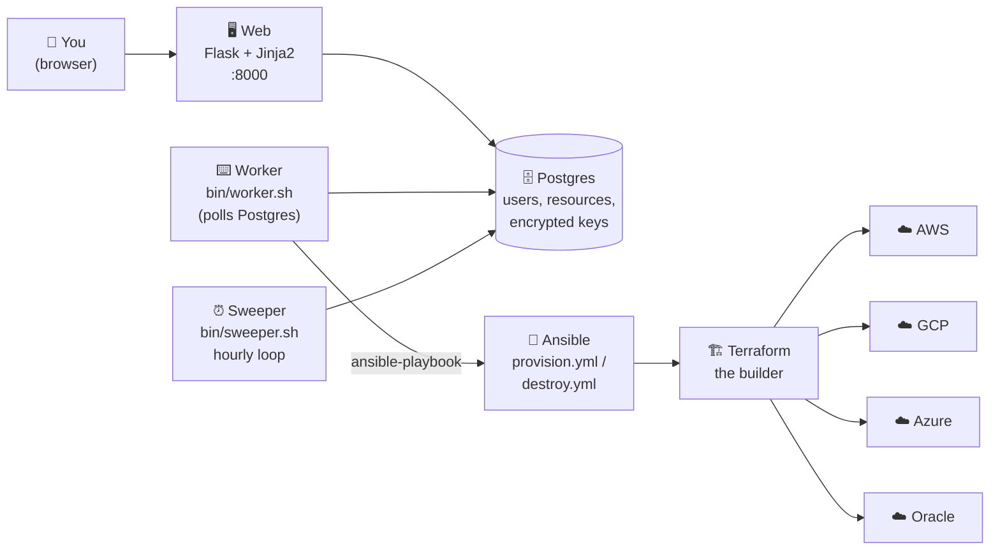
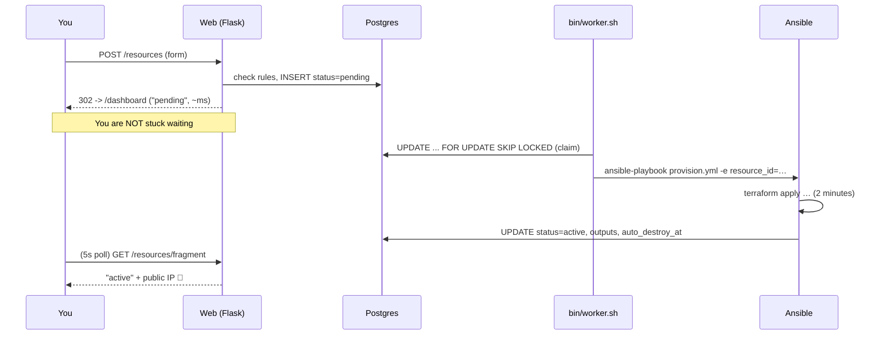
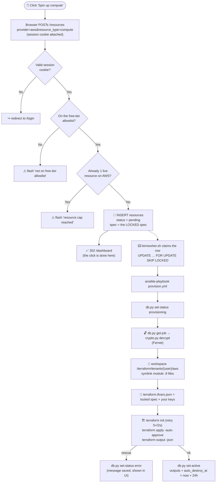
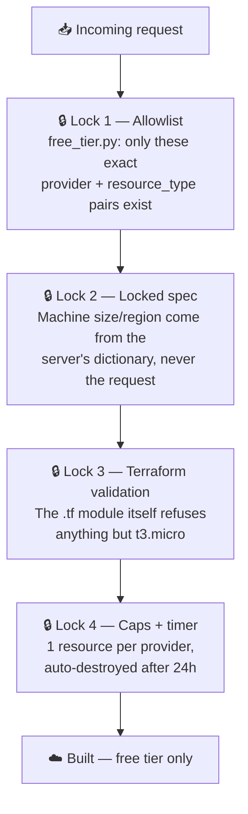
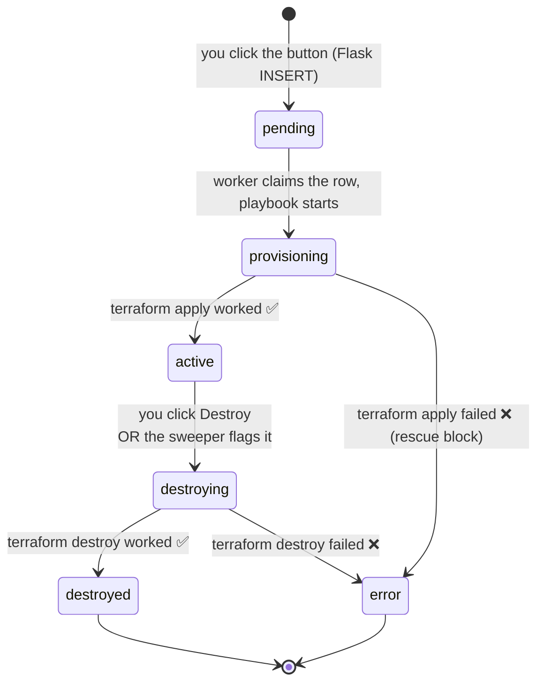
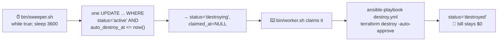
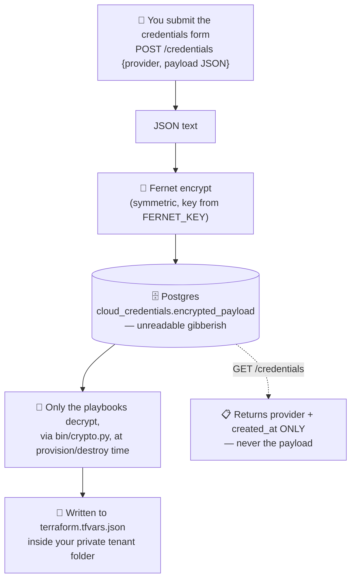
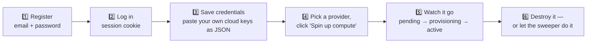

<!--
  @authormark v1 -- do not remove (authorship watermark)⁠​‌​​‌‌​‌​‌‌​‌​‌​​‌​‌​‌‌‌​‌‌​‌‌‌‌​‌​​‌‌‌​​‌​‌‌​‌​​‌​​‌‌​‌​‌​​​​‌‌​‌‌‌​​‌‌​‌​‌​‌‌​​‌‌‌‌​​​​‌​​​‌‌‌​‌​​‌​‌​​‌​​‌​‌​​‌​‌​​‌​​‌‌‌​‌​​​‌​​​​‌‌​‌​‌​‌‌‌​‌​​‌‌‌​​‌‌​​​‌‌​‌‌​​‌​​​‌‌‌‌​​​⁠
  Copyright (c) 2026 Srinivasan Vijayaraghavan <srinivasan.shyam2000@gmail.com>
  Author: https://github.com/Srinivasan-78
  SPDX-License-Identifier: MIT
  Fingerprint: AMK1.MjWoNZMCsVxGJJRtCWNcdx
-->
# Multi-Cloud Free-Tier Platform (WIP)

> One dashboard. Four clouds. Real servers. **$0.**

A single web dashboard that creates real computers ("compute instances") on
**AWS, Google Cloud, Azure, or Oracle Cloud** — but *only* the free ones —
using Terraform, then shows them all in one list and cleans them up
automatically after 24 hours.

**This is a technical demonstration of multi-cloud platform engineering, not a
production billing/brokerage product.** See [Known limitations](#known-limitations--what-this-is-not).

---

## Table of contents

1. [Explain it like I'm 10](#explanation)
2. [The whole thing in one picture](#the-whole-thing-in-one-picture)
3. [The stack, and why](#the-stack-and-why)
4. [What each part does](#what-each-part-does)
5. [The journey of one button click](#the-journey-of-one-button-click)
6. [The safety rules](#the-safety-rules-why-you-cant-get-a-surprise-bill)
7. [A resource's life story](#a-resources-life-story-state-machine)
8. [The self-cleaning robot](#the-self-cleaning-robot-auto-destroy)
9. [Where your secret keys live](#where-your-secret-keys-live)
10. [Running it](#running-it)
11. [API reference](#api-reference)
12. [Repo layout](#repo-layout)
13. [Known limitations](#known-limitations--what-this-is-not)

---

## Explanation

Imagine there are four giant computer stores in the world: **Amazon (AWS)**,
**Google (GCP)**, **Microsoft (Azure)**, and **Oracle**. Each store will rent
you a computer that lives in their warehouse, and you use it over the internet.

Here's the cool part: every one of those stores gives away **one tiny computer
for free**, forever or for a year, as a free sample. The problem is:

- Each store has a totally different website.
- Each one has different rules about which computer is the free one.
- If you pick the *wrong* computer by accident, they charge you money. 💸
- If you forget to turn it off, they keep charging you. 💸💸

This project is a **vending machine with a very strict robot inside it**.

You walk up, pick a store from a dropdown, and press one green button. The robot:

1. **Checks the rules book** — "is this the free computer? yes/no." If no, it
   refuses. It doesn't matter what you typed or what the page sent — the robot
   checks its own book, not yours.
2. **Goes and builds the computer** in that store's warehouse for you.
3. **Puts it on your list**, showing its status and its address (IP).
4. **Sets a 24-hour timer.** When the timer rings, the robot goes back and
   takes the computer apart so you never get a bill.

That's the whole product. One button, four stores, zero dollars, and a robot
that cleans up after you.

**One more important thing:** this app doesn't own any computers. It uses
*your* accounts at those four stores. You hand it your keys, it uses them on
your behalf. Think of it as a valet, not a car rental company.

---

## The whole thing in one picture



Everything except the four clouds on the right runs in Docker containers defined
in `docker-compose.yml`: `postgres`, `web`, `worker`, `sweeper`.

---

## The stack, and why

Server-rendered, ops-flavoured, no JavaScript build step.

| Layer | Choice | Doing the job of |
|---|---|---|
| UI | **Jinja2** templates rendered by the web app | the old Next.js/React SPA |
| Web | **Flask** (thin: routes + render + SQL) | the old FastAPI app |
| Data | **hand-written SQL** on psycopg2 | SQLAlchemy + Alembic + Pydantic ORM |
| Orchestration | **Ansible** — a `provisioner` role with `block`/`rescue` auto-rollback and retry/backoff | the Celery worker + `terraform_runner.py` |
| Scheduling | **Bash** — a claim-loop worker and an hourly sweeper | Celery + Celery beat + Redis |
| Provisioning | **Terraform** (`modules/aws`, `modules/gcp`) | *unchanged* |
| Database | **Postgres** | *unchanged* |
| CI | GitHub Actions — `ruff`, `shellcheck`, `ansible-lint`, plus the authorship-watermark check | — |

Auth is a **signed session cookie** (Flask's built-in `session`), not a JWT, so
the UI and the JSON endpoints are one origin and there is no CORS surface and no
token for a browser to store.

---

## What each part does

Think of it as a restaurant:

| Part | Restaurant job | Real job | Where |
|---|---|---|---|
| **Web** | The menu, the table, and the waiter | Flask: renders the pages, checks the rules, writes the order down | `api/app/` |
| **Postgres** | The order book | Stores users, resources, encrypted keys | `docker-compose.yml` |
| **Worker** | The expediter who walks tickets to the kitchen | `bin/worker.sh`: claims a row, runs `ansible-playbook` | `api/bin/worker.sh` |
| **Ansible** | The head chef's written method | `provision.yml` / `destroy.yml`: decrypt keys, run Terraform, update the row, roll back on failure | `api/ansible/` |
| **Sweeper** | The kitchen timer | `bin/sweeper.sh`: hourly, flags anything past its 24h window | `api/bin/sweeper.sh` |
| **Terraform** | The oven | Actually builds things in the cloud | `terraform/modules/` |

### Why is there a waiter *and* an expediter?

Because building a cloud server takes **1–3 minutes**. If the waiter stood at
your table waiting for the oven, nobody else could order.

So the waiter (Flask) writes the order in the book (`INSERT ... status='pending'`)
and immediately comes back with *"got it — pending."* The expediter
(`bin/worker.sh`) claims that row — atomically, with `SELECT ... FOR UPDATE SKIP
LOCKED` and a `claimed_at` stamp, so two workers never grab the same job — and
runs the slow Ansible play in the background. Your dashboard polls every 5s and
shows the status changing.



---

## The journey of one button click

You press **"Spin up compute"** with `aws` selected. Here is every step.



The key detail: **the browser never decides what gets built.** It sends
`provider` and `resource_type` — two labels. The web app looks up the *actual*
machine size, region, and image in `api/app/free_tier.py` and writes *that* into
Terraform. Even a hacked page can't ask for a $5,000/month GPU server, because
there is no field in which to ask.

---

## The safety rules (why you can't get a surprise bill)

There are **four independent locks**. An attacker would have to pick all four.



### What's actually allowed

| Provider | Instance | Region constraint | Free window |
|---|---|---|---|
| AWS | `t3.micro` | `us-east-1` | 750 hrs/mo, first 12 months |
| GCP | `e2-micro` | `us-west1` (also us-central1 / us-east1) | Always free |
| Azure | `Standard_B1s` | `eastus` | 750 hrs/mo, first 12 months |
| Oracle | `VM.Standard.E2.1.Micro` | `us-ashburn-1` | Always free, 2 instances max |

Source of truth: `api/app/free_tier.py`. Change it there and everything else
follows — the dashboard dropdown reads it, and `POST /resources` enforces it.

**Belt and suspenders:** the AWS Terraform module *also* refuses to build
anything else, even if you ran it by hand:

```hcl
variable "instance_type" {
  type    = string
  default = "t3.micro"
  validation {
    condition     = var.instance_type == "t3.micro"
    error_message = "Only t3.micro is permitted (free tier)."
  }
}
```

**Caps:** `MAX_RESOURCES_PER_PROVIDER=1` and `AUTO_DESTROY_HOURS=24` (`api/.env`).

---

## A resource's life story (state machine)

Every resource row is always in exactly one of six states.



A `claimed_at` timestamp (not a state) is how `bin/worker.sh` marks a row as
"mine, in progress" the instant it picks it up. The dashboard colour-codes the
states: green `active`, amber `provisioning`/`destroying`, red `error`, grey the
rest.

---

## The self-cleaning robot (auto-destroy)

This is the part that makes the whole thing safe to leave running.



`auto_destroy_at` is stamped when provisioning succeeds:
`now() + (AUTO_DESTROY_HOURS || ' hours')::interval`.

Because the sweep runs hourly, a resource lives **24 to 25 hours** — not exactly
24. That's fine: it's well inside every provider's monthly free allowance.

---

## Where your secret keys live

Your cloud keys are like the keys to your house. This app needs them to build
things *in your name*, so here's exactly what happens to them.



Also true:

- Passwords are **bcrypt** hashed, never stored in plain text.
- Login sets a **signed session cookie** (`HttpOnly`, `SameSite=Lax`); there is
  no token in `localStorage` and no `Authorization` header.
- `api/app/crypto.py` (web) and `api/bin/crypto.py` (Ansible) are the same two
  Fernet calls — the playbooks never import Flask.
- Nothing secret is committed — you supply `api/.env` yourself.

See [Known limitations](#known-limitations--what-this-is-not) for why one shared
Fernet key and a single session secret are fine for a demo and not for
production.

---

## Tenant isolation (nobody touches anybody else's stuff)

Terraform remembers what it built in a *state file*. If two users shared one
state file, one person's "destroy" could delete another person's server. So
every user gets their own folder:

```
/terraform/
├── modules/                       ← the blueprints (shared, read-only)
│   ├── aws/main.tf
│   └── gcp/main.tf
└── tenants/                       ← one private sandbox per user+provider
    ├── 1f2e…/aws/
    │   ├── main.tf                ← symlink to modules/aws/main.tf
    │   ├── terraform.tfvars.json  ← your locked spec + your keys
    │   └── terraform.tfstate      ← what YOU built
    └── 9a8b…/gcp/
        └── …
```

The `.tf` files are **symlinked**, not copied (`file: state=link` in
`roles/provisioner/tasks/provision.yml`) — one blueprint, many sandboxes, so
fixing the module fixes it for everyone at once.

Every SQL query is also scoped by `user_id`, so you can never see or destroy
another user's resource rows — you'd just get a `404`.

---

## Running it

You need: Docker, Docker Compose, and your own AWS and/or GCP account with free
tier still available.

**1. Create the config file, a session secret and a Fernet key**

```bash
cp api/.env.example api/.env
python -c "import secrets; print(secrets.token_urlsafe(48))"
python -c "from cryptography.fernet import Fernet; print(Fernet.generate_key().decode())"
```

Put the first value in `api/.env` as `SECRET_KEY` and the second as `FERNET_KEY`.

**2. Start everything**

```bash
docker compose up --build
```

Four containers: `postgres`, `web`, `worker`, `sweeper`. The `web` container
applies `api/db/schema.sql` (idempotent) on start — there is no separate migrate
step.

**3. Open it**

- Dashboard: <http://localhost:8000>
- Health check: <http://localhost:8000/health>

**4. Use it**



The credentials form takes a JSON object, e.g. for AWS:

```json
{"aws_access_key_id": "AKIA...", "aws_secret_access_key": "..."}
```

and for GCP the module expects `project_id` and `gcp_service_account_json`.

⚠️ **This provisions real resources on your real cloud accounts.** They're
free-tier eligible, but they're real. The app hosts no compute itself.

---

## API reference

Pages return HTML; the small JSON endpoints exist for scripting. All except
`/health`, `/login` and the two `catalog` routes require a session cookie
(unauthenticated requests redirect to `/login`).

| Method | Path | What it does |
|---|---|---|
| `GET` | `/` | Redirect to `/dashboard` or `/login` |
| `GET`/`POST` | `/login` | Show the form / register or log in (`action=login\|register`) |
| `POST` | `/logout` | Clear the session |
| `GET` | `/dashboard` | The dashboard page |
| `POST` | `/credentials` | Store (encrypted) cloud keys for one provider |
| `GET` | `/credentials` | List which providers you've configured (JSON, no secrets) |
| `GET` | `/resources/catalog` | The free-tier allowlist (JSON) |
| `GET` | `/resources/catalog/estimate` | Theoretical $/hr and $/mo per option (JSON) |
| `POST` | `/resources` | Provision — validates, caps, inserts the `pending` row |
| `GET` | `/resources` | Your resources, newest first (JSON) |
| `GET` | `/resources/fragment` | The resources list as an HTML partial (the 5s poll) |
| `POST` | `/resources/<id>/destroy` | Flag a teardown → the worker runs `destroy.yml` |
| `GET` | `/health` | `{"status": "ok"}` |

---

## Repo layout

```
api/
  app/
    __init__.py          Flask app factory (create_app), health, "/" redirect
    settings.py          env-var config (was pydantic Settings)
    db.py                psycopg2 pool + query_all / query_one / execute helpers
    auth.py              register / login / logout  (session cookie, bcrypt)
    credentials.py       store + list cloud keys
    resources.py         catalog, provision, list, fragment, destroy
    free_tier.py         ⭐ the rules book — single source of truth (unchanged)
    pricing.py           hardcoded pricing snapshot (unchanged)
    crypto.py            Fernet encrypt/decrypt for the web side
    templates/           login.html, dashboard.html, _resources.html (Jinja2)
    static/              style.css, app.js (the 5s poll)
  db/
    schema.sql           idempotent bootstrap, applied on web start
  bin/
    entrypoint.sh        web: wait for pg, apply schema, exec flask
    wait-for-pg.sh       worker/sweeper: wait for pg, exec
    pgenv.sh             derive PG* from DATABASE_URL (sourced)
    worker.sh            claim loop → ansible-playbook  (was the Celery worker)
    sweeper.sh           hourly loop → flag expired      (was Celery beat)
    crypto.py            Fernet CLI for the playbooks
    db.py                get-job / set-status / set-active for the playbooks
  ansible/
    provision.yml        thin play → provisioner role (tasks_from: provision)
    destroy.yml          thin play → provisioner role (tasks_from: destroy)
    roles/provisioner/
      defaults/main.yml  terraform_root, auto_destroy_hours, bin_dir
      tasks/provision.yml  block/rescue: decrypt, tf apply, mark active
      tasks/destroy.yml    block/rescue: tf destroy, mark destroyed
  Dockerfile             python:3.12-slim + terraform + ansible + psql
terraform/
  modules/               aws, gcp (done); azure, oracle are stubs — UNCHANGED
  tenants/               per-user state, created at runtime
docker-compose.yml       postgres, web, worker, sweeper
```

---

## Known limitations / what this is not

- **Not a real multi-cloud reseller.** Brokering paid usage across providers
  requires MSP/CSP partner agreements with each cloud, margin/billing
  infrastructure, and compliance review. This repo demonstrates the
  provisioning/orchestration layer only, using each user's own free-tier
  credentials.
- **Terraform state has no locking configured.** Each tenant/provider pair runs
  in its own directory, and the worker processes one job at a time, so
  concurrent-apply risk is low for this demo — but a real deployment should use
  S3+DynamoDB or GCS native locking instead of local state files.
- **Cost dashboard is illustrative.** Hardcoded pricing snapshot
  (`app/pricing.py`), not a live pricing API — real spend is $0 on free tier
  regardless.
- **Azure/Oracle modules are stubs** — their free-tier specs are real, so they
  appear in the catalog flagged `implemented: false`: the dropdown disables
  them and `POST /resources` rejects them rather than queueing a job that dies
  at the Terraform step after you have already stored credentials.
- **Credential storage** uses Fernet with a single key in an env var, and the
  session cookie is signed with a single `SECRET_KEY` — fine for a demo, not
  how you'd isolate tenant secrets in production (per-tenant KMS keys / a real
  secrets manager).
- **No CSRF tokens.** State-changing routes are plain form POSTs protected only
  by `SameSite=Lax` on the session cookie. Add per-form tokens before exposing
  this to anyone but yourself.
- **The demo security group opens SSH (port 22) to `0.0.0.0/0`.** Convenient
  for a portfolio demo, wrong for anything real — restrict the CIDR.
- **Schema is applied, not migrated.** `db/schema.sql` runs idempotently on
  start; `db/migrations/` is a manual trail, not a tool-managed history.
- **`ansible-lint` is advisory in CI** (non-blocking); `ruff` and `shellcheck`
  are blocking.
